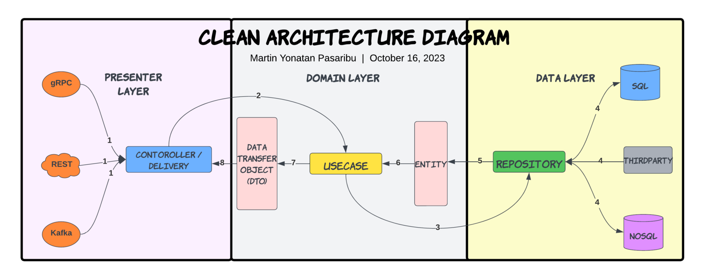

## Golang Clean Architecture

This is an example of implementation of Real World Application [backend-specs](https://realworld-docs.netlify.app/docs/specs/backend-specs/endpoints)

## 🔥 Layers of Domain

- [Controller / Delivery](https://github.com/DoWithLogic/go-echo-realworld/tree/main/internal/users/delivery)
- [Data Transfer Object (DTO)](https://github.com/DoWithLogic/go-echo-realworld/tree/main/internal/users/dtos)
- [Usecase](https://github.com/DoWithLogic/go-echo-realworld/tree/main/internal/users/usecase)
- [Entity](https://github.com/DoWithLogic/go-echo-realworld/tree/main/internal/users/entities)
- [Repository](https://github.com/DoWithLogic/go-echo-realworld/tree/main/internal/users/repository)

#### The diagram:



# 🦄 TO DO :

- Application
  - [x] [Go-Standards](https://github.com/golang-standards/project-layout) Project Layout
  - [x] Environment Variable Configuration
  - [x] Health-Check and Debug API
  - [ ] Graceful Shutdown
- Layered architecture
  - [x] [SOLID Principle](https://en.wikipedia.org/wiki/SOLID)
  - [x] Database Transaction
- HTTP Server
  - [x] [Echo framework](https://echo.labstack.com/)
  - [x] Server Side Caching
    - [ ] Cache but revalidate (Header `Cache-Control: no-cache`)
    - [ ] Set Expiration Time (Header `Cache-Control: max-age=120`)
  - [ ] Request ID in logger (Header `X-Request-Id: xxx`)
- RESTful
  - [x] Create Resource (`POST` verb)
  - [x] Update Resource (`PUT` verb)
  - [x] Partially Update Resource (`PATCH` verb)
  - [ ] Find Resource (`GET` verb)
    - [ ] Offset Pagination (Query param `?limit=10&page=1`)
    - [ ] Sorting (Query param `?sort=fullname DESC,id DESC`)
- Testing
  - [x] Table Driven Test
  - [x] Mocking
- Others
  - [x] Database migration and seed tool
  - [x] Releaser

## 🏗️ How To Run

setup environment and running on local
```bash
make run    # Start the database, run migrations, and start the application locally
```


## ✨ References

Golang:
- [Go Documentation](https://golang.org/doc/)
- [Go For Industrial Programming](https://peter.bourgon.org/go-for-industrial-programming/)
- [Uber Go Style Guide](https://github.com/uber-go/guide)
- [Go Code Review Comments](https://github.com/golang/go/wiki/CodeReviewComments)
- [typical-rest-server](https://github.com/typical-go/typical-rest-server/)
- [go-clean-arch](https://github.com/bxcodec/go-clean-arch)
- [a-clean-way-to-implement-database-transaction-in-golang](https://dev.to/techschoolguru/a-clean-way-to-implement-database-transaction-in-golang-2ba)


## 🛡️ License

This project is licensed under the [MIT License](https://github.com/DoWithLogic/go-echo-realworld/blob/main/LICENSE).
